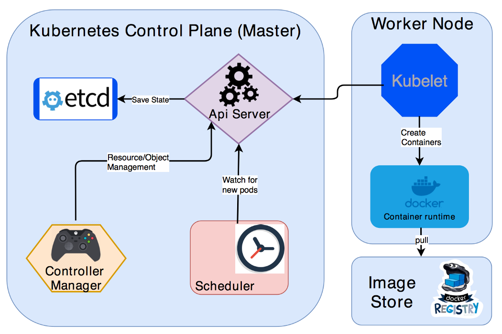

## Question (1/10)

Note: All questions are mandatory and must be answered to proceed. If you need help, click on the "Show Answers" button.

---

A Kubernetes (k8s) cluster consists of both **Control Plane** Nodes and **Worker** Nodes. You will typically have more Worker Nodes than Control Plane Nodes as the Worker Nodes are what host the actual application workload and are given workload definitions by the Control Plane Nodes.  One critical component of the Control Plane is the **api-server** which provides the frontend to the cluster's shared state through which all other components interact.  The foremost tool to interact with the api-server is a the **kubectl** client - here are some examples of how to use kubectl: [kubectl cheatsheet](https://kubernetes.io/docs/reference/kubectl/cheatsheet/). 

In this scenario, a k8s cluster is provisioned and we will use kubectl to inspect the cluster.

`kubectl get no -o wide`{{execute}}
---

>>Q1: How many worker nodes is this cluster running?<<
=== 2
