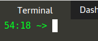

## Kubernetes Lab Intro

---

**WARNING - YOU HAVE LESS THAN 1 HOUR BEFORE YOUR SESSION EXPIRES!**

>Note the time left (in HH:MM) for the session, it is in your prompt and updated after every command run:

## Kubernetes CLI, Namespaces, YAML, Deployments

In this lab, we are going to:
- Utilize the **kubectl** CLI to interact with our Kubernetes cluster 
- Create a Kubernetes **Namespace**
- Run an application by implementing a **Deployment**

Commands will look like this:

`echo Hello`{{execute}}

Expected output will look like this

> _"Hello"_

