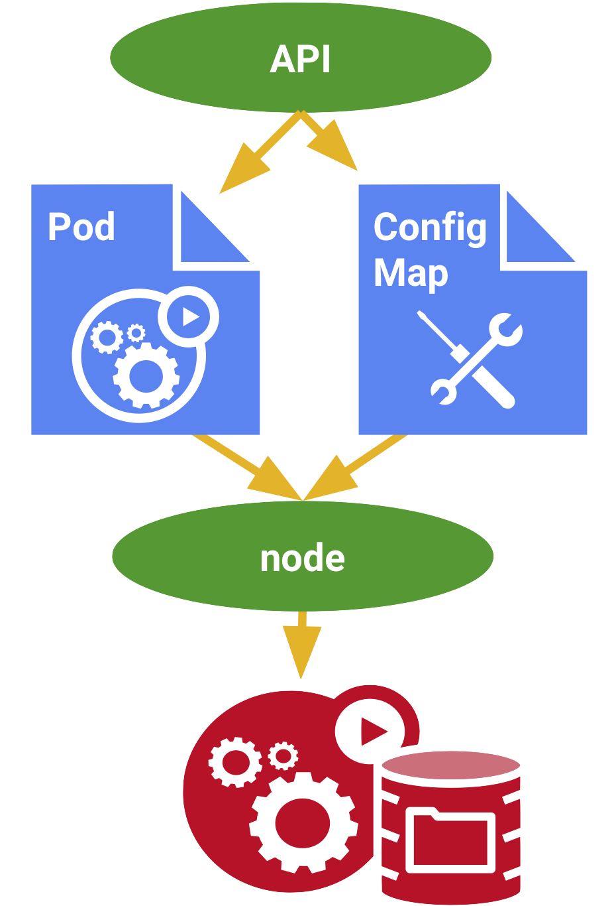

---

## Config Map

---

A ConfigMap is an API object used to store non-confidential data in key-value pairs. Pods can consume ConfigMaps as environment variables, command-line arguments, or as configuration files in a volume.

A ConfigMap allows you to decouple environment-specific configuration from your container images, so that your applications are easily portable.

---

## Deploying a ConfigMap

Display the contents of nginx-cm.yaml to see what's inside.

`cat nginx-cm.yaml`{{execute}}

Deploy the ConfigMap.

`kubectl apply -f nginx-cm.yaml`{{execute}}

---

## Referencing the ConfigMap

Now we will review and deploy a yaml file with a Deployment and Service.  This will reference the configmap in your deployment and deploy the service.

`cat hello-web-deploy-svc.yaml`{{execute}}

`kubectl apply -f hello-web-deploy-svc.yaml; kubectl -n default wait deploy/hello-web-a123456 --for=condition=available --timeout=120s`{{execute}}

---

## Confirm the ConfigMap was loaded

Test connectivity to nginx: Please note, if the pod fails to connect, wait for about 2 minutes. 
`kubectl run -n default -i --rm --restart=Never curl-test --generator=run-pod/v1 --image=radial/busyboxplus:curl -- sh -c "curl -vvv hello-service-a123456.default.svc.cluster.local"`{{execute}}

> _"pod "curl-test" deleted"_

