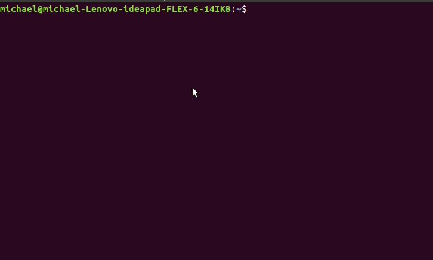

Just follow the steps...

## Get ready for the glory that is sheep enthusiast

`docker pull palassml/cond-cowsay:latest `{{execute}}

`docker run -it palassml/cond-cowsay:latest sh -c 'COW=/usr/share/cowsay/cows/sheep.cow && echo "Hi Kirk" |  cowsay -f ${COW}'`{{execute}}

